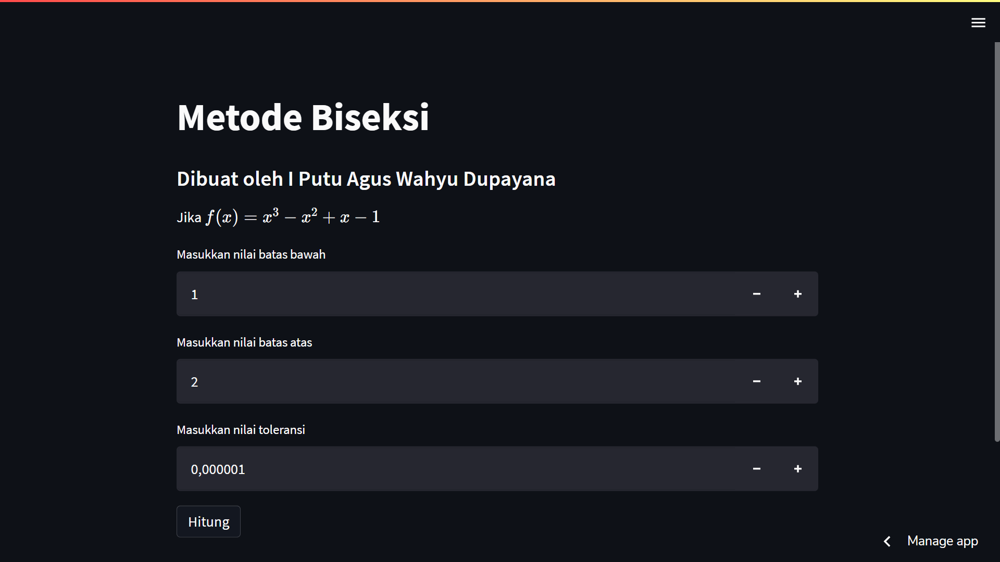

# Streambisection

## Description

This project is an implementation of the bisection algorithm in discrete mathematics using Python and Streamlit's help to create web apps

## Screenshots

## About

License : [Apache License 2.0](LICENSE)
